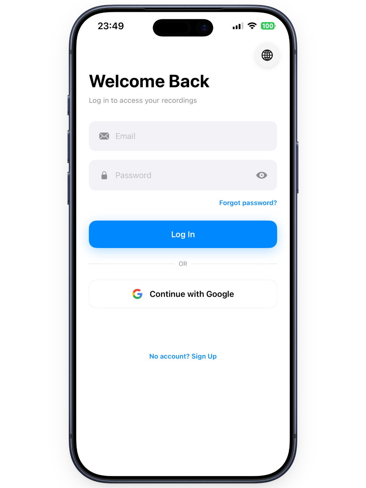
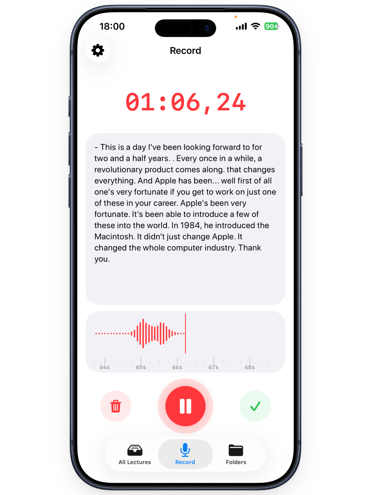
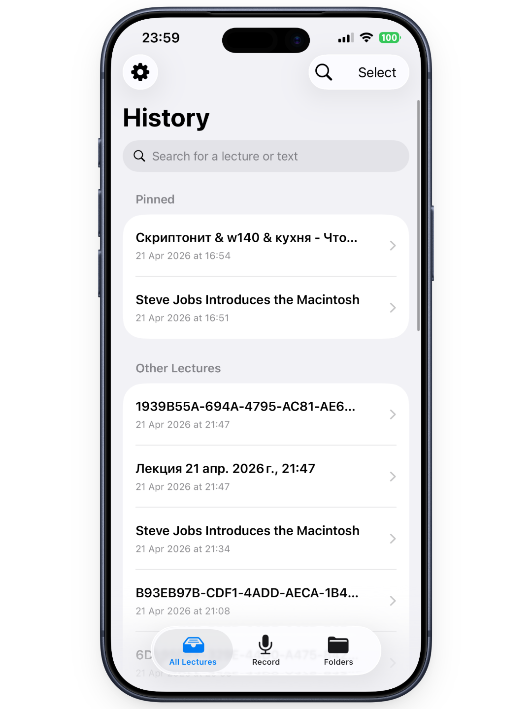
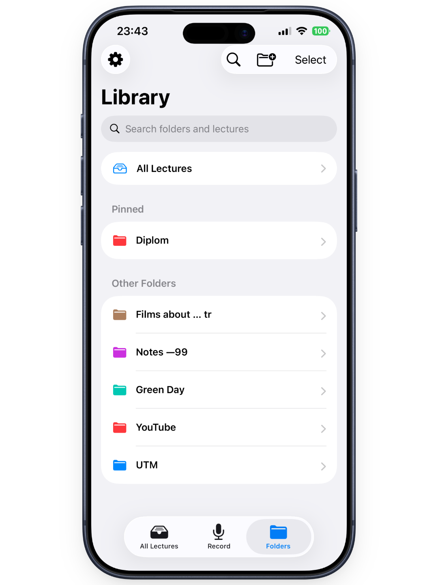
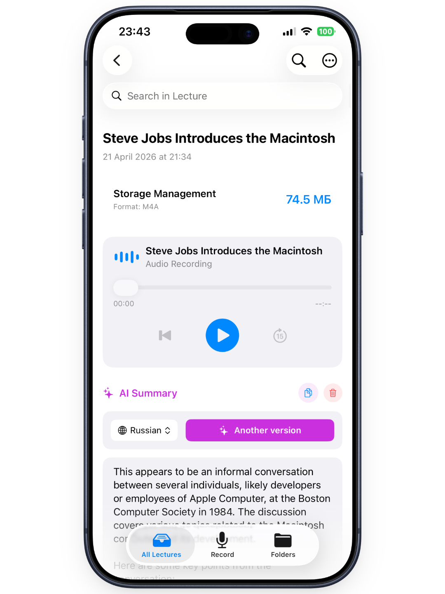
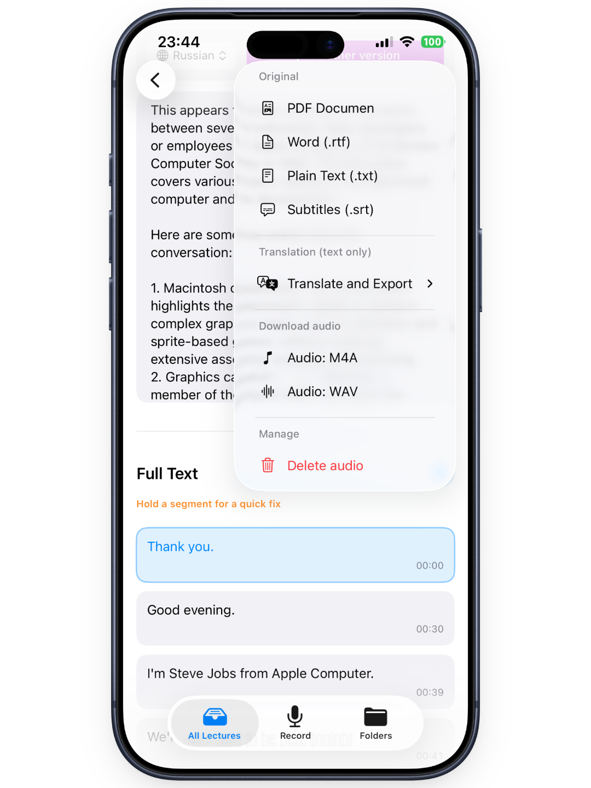

# Lector iOS Client


Lector is a native iOS application designed for intelligent recording, real-time transcription, and multi-lingual summarization of lectures and voice notes. It integrates deeply with a custom high-performance backend to provide seamless AI-driven processing while maintaining robust local offline capabilities.

**Backend Repository:** [Lector-Backend](https://github.com/CozlovschiNichita/Lector-Backend)

---

### App Demonstration / Демонстрация приложения

<p align="center">
  
  <br>
  <em>Real-time audio transcription and UI showcase</em>
</p>

---

### Full Video Walkthrough / Полный обзор приложения

[](https://youtu.be/ТВОЙ_ID_ВИДЕО_НА_YOUTUBE)
*(Click the image above to watch the full 3-minute demonstration on YouTube)*

---

### App Screenshots / Интерфейс

<p align="center">
  
</p>

---

## Table of Contents
- [English Version](#english-version)
  - [Key Features](#key-features)
  - [Architecture & Tech Stack](#architecture--tech-stack)
  - [Installation & Setup](#installation--setup)
  - [Project Directory Structure](#project-directory-structure)
- [Русская версия](#русская-версия)
  - [Ключевой функционал](#ключевой-функционал)
  - [Архитектура и Стек](#архитектура-и-стек)
  - [Установка и запуск](#установка-и-запуск)
  - [Структура директорий проекта](#структура-директорий-проекта)

---

## English Version

### About the Project
The client application of the Lector platform, developed using modern iOS development paradigms. The app handles raw audio capture, on-the-fly format conversion, secure persistent storage, and WebSocket communication with the backend to deliver streaming transcription and AI analysis.

### Key Features
* **Offline-First Synchronization:** A custom background daemon (`SyncManager`) ensures that lectures recorded without internet access are safely stored locally via `SwiftData` and automatically pushed to the server once connectivity is restored.
* **Real-time Transcription:** Streaming audio buffers to the server via WebSockets with instant rendering of the recognized text, mapped to specific timestamps.
* **Advanced Media Handling:** Local file uploading (mp3, m4a, wav, mp4, mov) with native hardware-accelerated audio extraction using `AVFoundation`.
* **Hardware-Accelerated UI:** Custom audio waveform rendering utilizing SwiftUI's `Canvas` (Metal-backed) for 60 FPS performance without CPU throttling.
* **Enterprise-Grade Security:** Biometric authentication (Face ID / Touch ID) for app access, blur-overlay protection in the app switcher, and secure JWT storage utilizing the iOS `Keychain` API.
* **Native Translation Pipeline:** Integration with iOS 18+ `Translation` framework for on-device, privacy-preserving text translation and document export (PDF, RTF, TXT, SRT).

### Architecture & Tech Stack
The application strictly follows the **MVVM (Model-View-ViewModel)** architectural pattern combined with a Service-Oriented approach.
* **UI Layer:** SwiftUI (Declarative, state-driven interfaces).
* **Business Logic:** ViewModels combined with stateless background Services (`AudioService`, `ImportService`, `SocketService`).
* **Networking:** `URLSession` with a custom generic `APIClient` featuring automatic JWT token refresh, and `URLSessionWebSocketTask` for bi-directional streams.
* **Audio Processing:** `AVFoundation` (microphone capture, Float32 to 16kHz PCM on-the-fly conversion).
* **Persistence:** `SwiftData` for reactive local caching and `KeychainServices` for cryptographic key storage.

### Installation & Setup
1. Clone the repository to your local machine.
2. Open `LectorApp.xcodeproj` in Xcode 15 or later.
3. Locate the `APIClient.swift` and `SocketService.swift` files (or your designated configuration file) and update the `baseURL` to point to your deployed Lector Backend.
4. Select a physical iOS device as the run destination (Simulator does not support accurate microphone audio extraction).
5. Build and run the project (`Cmd + R`).

---

### Project Directory Structure
```text
LectorApp/
├── Managers/          # Global state daemons (SyncManager, AuthManager, AudioPlayer)
├── Services/          # Stateless background workers (API, Audio, Sockets, Imports)
├── ViewModels/        # Screen-specific business logic & state preparation
├── Models/            # SwiftData schema definitions & DTO API contracts
├── Views/             # SwiftUI Declarative UI
│   ├── Auth/          # Login, Registration, Password Recovery
│   ├── MainScreens/   # Primary Tab Navigation (History, Folders)
│   ├── Recording/     # Live transcription & audio capture interfaces
│   ├── Detail/        # Post-processing, AI summaries, text editing
│   └── Components/    # Reusable UI elements (MiniPlayer, Toasts, Offline Indicators)
├── Storage/           # Secure data persistence (Keychain)
└── Utils/             # Extensions and Helper functions
```

---

## Русская версия

### О проекте
Клиентское приложение платформы Lector, разработанное с использованием современных подходов к нативной iOS-разработке. Приложение отвечает за захват аудио, конвертацию форматов "на лету", безопасное хранение данных и взаимодействие с сервером по протоколу WebSocket для получения потоковой транскрипции.

### Ключевой функционал
* **Офлайн-режим и Синхронизация:** Собственный фоновый демон (`SyncManager`) гарантирует, что лекции, записанные без доступа к сети, надежно сохраняются в локальную БД (`SwiftData`) и автоматически выгружаются на сервер при восстановлении связи.
* **Транскрипция в реальном времени:** Потоковая передача аудио-буферов на сервер с мгновенным отображением распознанного текста и привязкой к таймкодам.
* **Продвинутый импорт медиа:** Загрузка файлов (mp3, m4a, wav, mp4, mov) с нативным аппаратным извлечением аудио-дорожки средствами `AVFoundation`.
* **Оптимизированный UI:** Отрисовка аудиоволны (эквалайзера) с использованием `Canvas` (на базе графического движка Metal) для обеспечения стабильных 60 FPS без нагрузки на процессор.
* **Безопасность корпоративного уровня:** Биометрическая аутентификация (Face ID / Touch ID), скрытие контента (blur) в меню многозадачности ОС и безопасное хранение JWT-токенов в `Keychain`.
* **Нативный перевод:** Интеграция с системным фреймворком `Translation` (iOS 18+) для локального перевода конспектов и их экспорта в форматы PDF, RTF, TXT, SRT.

### Архитектура и Стек технологий
Проект строго следует паттерну **MVVM (Model-View-ViewModel)** в связке с сервис-ориентированным подходом (SOA).
* **UI Слой:** SwiftUI (Декларативный интерфейс, управляемый состояниями).
* **Бизнес-логика:** ViewModels, делегирующие тяжелые задачи независимым сервисам (`AudioService`, `ImportService`, `SocketService`).
* **Сеть:** `URLSession` с кастомным `APIClient`, поддерживающим автоматическое обновление просроченных токенов (Refresh Token), и `URLSessionWebSocketTask` для сокетов.
* **Аудио:** `AVFoundation` (работа с буферами памяти, потоковая конвертация Float32 в 16kHz PCM).
* **Хранение данных:** `SwiftData` для кэширования объектов и `KeychainServices` для криптографического хранения ключей доступа.

### Установка и запуск
1. Склонируйте репозиторий на ваш Mac.
2. Откройте `LectorApp.xcodeproj` в Xcode 15 или новее.
3. В файлах `APIClient.swift` и `SocketService.swift` укажите актуальный `baseURL` вашего развернутого сервера Lector.
4. Выберите физическое устройство для запуска (iOS Симулятор не поддерживает корректный захват потокового аудио с микрофона).
5. Выполните сборку проекта (`Cmd + R`).

---

### Структура директорий проекта
```text
LectorApp/
├── Managers/          # Глобальные менеджеры состояний (SyncManager, AuthManager, AudioPlayer)
├── Services/          # Фоновые воркеры без состояния (API, Audio, Sockets, Imports)
├── ViewModels/        # Бизнес-логика экранов и подготовка состояний
├── Models/            # Схемы SwiftData и контракты DTO API
├── Views/             # Декларативный UI на SwiftUI
│   ├── Auth/          # Авторизация, регистрация, восстановление пароля
│   ├── MainScreens/   # Главная навигация по табам (История, Папки)
│   ├── Recording/     # Интерфейсы записи и живой транскрипции
│   ├── Detail/        # Постобработка, ИИ-конспекты, редактирование текста
│   └── Components/    # Переиспользуемые UI-элементы (MiniPlayer, Тосты, Индикаторы сети)
├── Storage/           # Безопасное хранение данных (Keychain)
└── Utils/             # Расширения и вспомогательные функции
```

---

**Author:** [Nikita Kozlovskii](https://www.linkedin.com/in/nikitakozlovskii) | **Role:** `Full-Stack iOS Developer` | [](https://www.linkedin.com/in/nikitakozlovskii)
